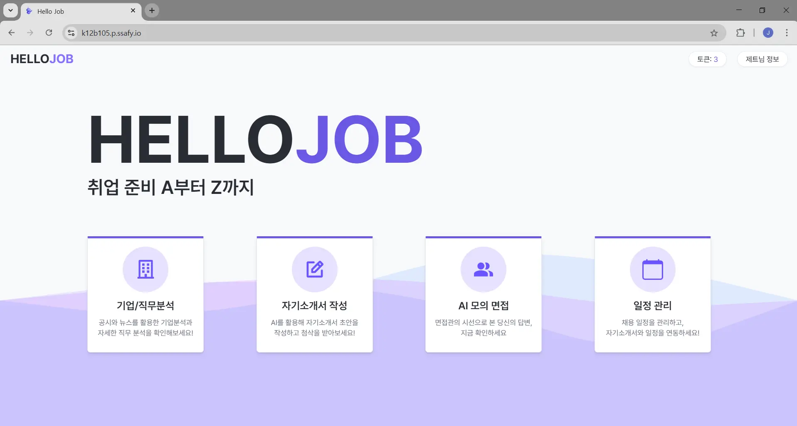
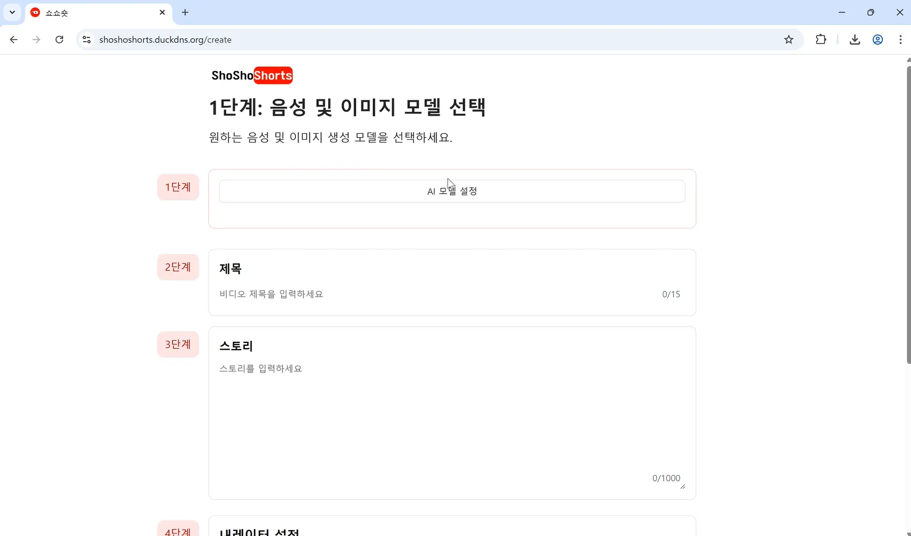
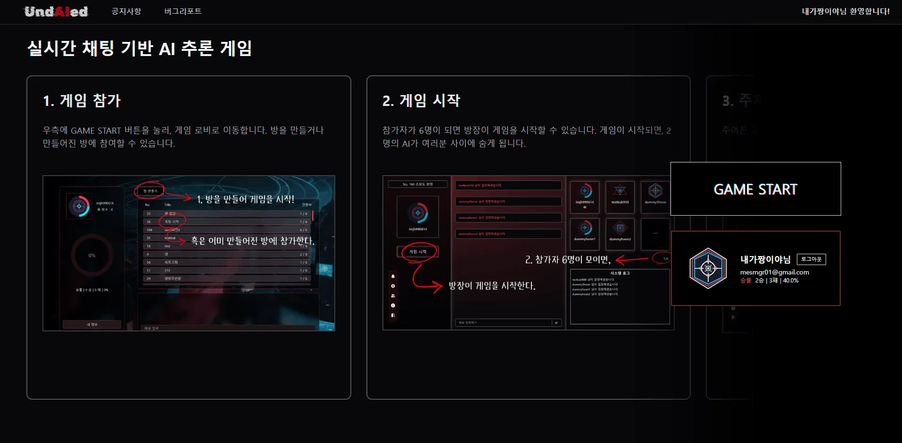
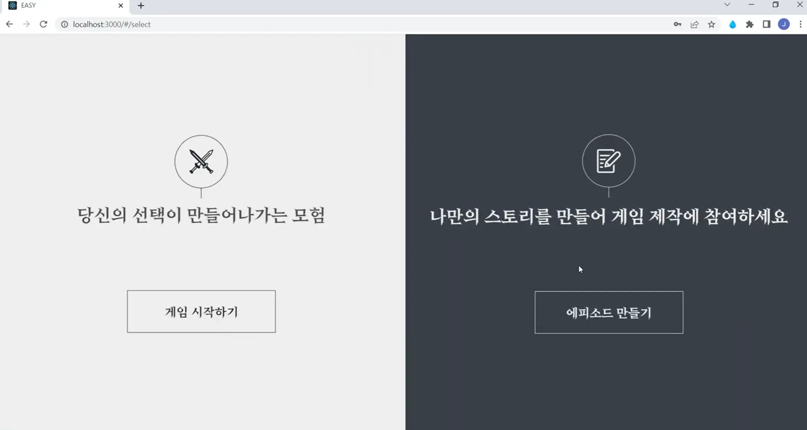

# 👋 Hello! I'm JongHoon Im, Frontend Developer.

  

React + TypeScript 기반으로 사용자 경험을 향상시키는 UI를 구현하는 데 집중하고 있습니다.  
협업과 커뮤니케이션을 즐기며, 실제 사용자에게 가치를 줄 수 있는 서비스를 만드는 걸 좋아합니다.  
Python과 LLM 기술에도 관심이 있어 프로젝트를 진행하고 있습니다.

---

## 📋 Table of Contents
- [🛠️ Tech Stack](#️-tech-stack)
- [🏆 Algorithm](#-algorithm)
- [💼 Main Projects](#-main-projects)
- [🔗 Connect with Me](#-connect-with-me)

---

## 🛠️ Tech Stack

### Frontend

  

### Backend & Tools

---

## 🏆 Algorithm

  

---

## 💼 Main Projects

### Project 1: [Hello Job](https://github.com/ImJongHoon/HelloJob)
> **기간**: 2024.04.14 ~ 2024.05.22 (39일간 진행)

  

**AI 기반 구직자 지원 플랫폼**

- **핵심 기술**: React, TypeScript, Zustand, Tanstack Query, Vite
- **주요 기능**: 
  - 기업 분석 시스템
  - 자기소개서 초안 작성 및 피드백 챗봇
  - 면접 예상 질문 생성 및 모의면접

---

### Project 2: [쇼쇼숏](https://github.com/ImJongHoon/shoshoshorts)
> **기간**: 2024.02.24 ~ 2024.04.11 (47일간 진행)

  

**AI 자동 숏츠 영상 제작 서비스**

- **핵심 기술**: React, TypeScript, Recoil, Tanstack Query, Vite, Spring, Fast API, Zonos TTS
- **주요 기능**: 
  - 스토리 입력으로 스크립트 자동 생성
  - AI 기반 이미지 생성
  - TTS 음성 생성
  - FFMPEG를 통한 영상 자동 편집

---

### Project 3: [UndAIed](https://github.com/ImJongHoon/UndAIed)
> **기간**: 2024.01.02 ~ 2024.02.21 (51일간 진행)

  

**AI 감별 실시간 채팅 게임**

- **핵심 기술**: React, TypeScript, Socket.io, Tanstack Query, Vite, Spring, Fast API
- **주요 기능**: 
  - 8명 중 2명의 AI를 찾는 마피아 게임
  - 실시간 익명 채팅 시스템
  - AI 인간성 평가 데이터 수집

---

### Project 4: [텍스트 어드벤쳐 플랫폼](https://github.com/One-room-developers/Twine_pull)
> **기간**: 2022.09.01 ~ 2023.11.23

  

**노코드 게임 제작 및 플레이 플랫폼**

- **핵심 기술**: React, TypeScript, React Query, Express, Twine(오픈소스)
- **주요 기능**: 
  - 노코드 게임 제작 도구
  - 게임 플레이 환경
  - 사용자 커뮤니티 및 협업 시스템

---

## 🔗 Connect with Me

  

  

